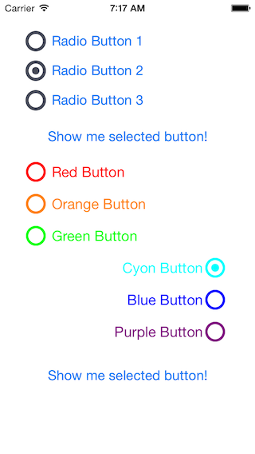
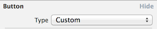
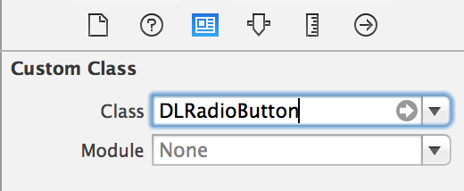
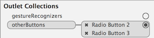
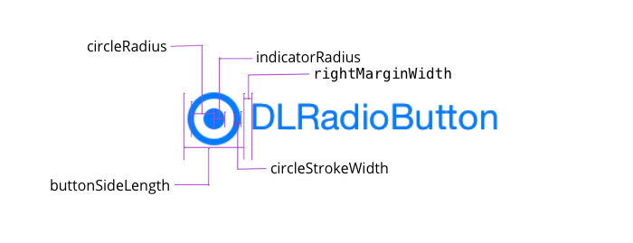

# DLRadioButton 

## Preview

## Usage

####To run the example project, clone the repo, and run `pod install` from the Example directory first.

####To use this Pod from interface builder:

* Put some UIButtons onto a View
* Change the UIButtons' type to "custom"

* Set the UIButtons' class to "DLRadioButton"

* Set "otherButtons" outlet

####To use this Pod from code:

    #import "DLRadioButton.h"

    // programmatically add buttons
    
    // first button
    DLRadioButton *firstRadioButton = [[DLRadioButton alloc] initWithFrame:CGRectMake(30, 200, 200, 30)];
    firstRadioButton.buttonSideLength = 30;
    [firstRadioButton setTitle:@"Red Button" forState:UIControlStateNormal];
    [firstRadioButton setTitleColor:[UIColor redColor] forState:UIControlStateNormal];
    firstRadioButton.circleColor = [UIColor redColor];
    firstRadioButton.indicatorColor = [UIColor redColor];
    firstRadioButton.contentHorizontalAlignment = UIControlContentHorizontalAlignmentLeft;
    
    // add other buttons
    [self.view addSubview:firstRadioButton];
    NSArray *colorNames = @[@"Orange", @"Green", @"Cyon", @"Blue", @"Purple"];
    NSArray *buttonColors = @[[UIColor orangeColor], [UIColor greenColor], [UIColor cyanColor], [UIColor blueColor], [UIColor purpleColor]];
    NSInteger i = 0;
    NSMutableArray *otherButtons = [NSMutableArray new];
    for (UIColor *buttonColor in buttonColors) {
        // customize this button
        DLRadioButton *radioButton = [[DLRadioButton alloc] initWithFrame:CGRectMake(30, 240+40*i, 200, 30)];
        radioButton.buttonSideLength = 30;
        [radioButton setTitle:[colorNames[i] stringByAppendingString:@" Button"] forState:UIControlStateNormal];
        [radioButton setTitleColor:buttonColor forState:UIControlStateNormal];
        radioButton.circleColor = buttonColor;
        radioButton.indicatorColor = buttonColor;
        radioButton.contentHorizontalAlignment = UIControlContentHorizontalAlignmentLeft;
        [otherButtons addObject:radioButton];
        [self.view addSubview:radioButton];
        i++;
    }
    firstRadioButton.otherButtons = otherButtons;

####To customize DLRadiobutton:

There are a bunch of properties that you can set for your Radio Button, please use the following picture for reference:

## Requirements

ARC

## 

DLRadioButton is available through [CocoaPods](http://cocoapods.org). To install
it, simply add the following line to your Podfile:

    pod "DLRadioButton"

## Author

Xingruo Liu, xingruo.liu@gmail.com

## License

DLRadioButton is available under the MIT license. See the LICENSE file for more info.