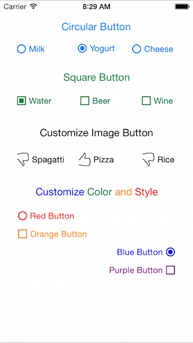

# DLRadioButton 

`DLRadioButton` is an easy to use and highly customizable radio buttons control for iOS. It's a subclass of `UIButton`, and works smoothly with both `Objective-C` and `Swift`.

Since release, it has became the most popular radio buttons control for iOS🎉. Thank you for great feedbacks and making it better for all of us👏.

## Preview

## Usage

####To install:
*	Option 1: simply put `DLRadioButton.h` and `DLRadiobutton.m` in your project.
*	Option 2: add `pod 'DLRadioButton', '~> 1.4'` to your `Podfile`.
*	Option 3: add `github "DavydLiu/DLRadioButton" ~> 1.4` to your `Cartfile`.

####To add radio buttons in interface builder:

1.  Put some UIButtons onto a View and change the UIButtons' type to "custom".

	

2.  Set the UIButtons' class to "DLRadioButton".

	

3.	Set "otherButtons" outlet.

	

####To customize DLRadiobutton:

*	Simply set properties directly in Interface Builder.

	

*	Property reference:
	
	
	
####To add raido buttons programmatically, please refer to example project.

## Requirements

ARC, iOS 6.0

## Author

David Liu. For help or any questions, feel free to [open an issue](https://github.com/DavydLiu/DLRadioButton/issues/new).

## License

DLRadioButton is available under the MIT license.
