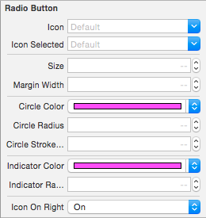

# DLRadioButton 

## Preview

## Usage

####To install:
*	Put `DLRadioButton.h` and `DLRadiobutton.m` in your project, or add `Pod DLRadioButton` to your Podfile.

####To add radio buttons in interface builder:

1.  Put some UIButtons onto a View and change the UIButtons' type to "custom".

	

2.  Set the UIButtons' class to "DLRadioButton".

	

3.	Set "otherButtons" outlet.

	

####To customize DLRadiobutton:

*	Simply set properties directly in Interface Builder.

	

*	Property reference:
	
	
	
####To add raido buttons programmatically, please refer to example project.

## Requirements

ARC, iOS 6.0

## Author

David Liu. For help or any qeustions, feel free to [open an issue](https://github.com/DavydLiu/DLRadioButton/issues/new).

## License

DLRadioButton is available under the MIT license.
